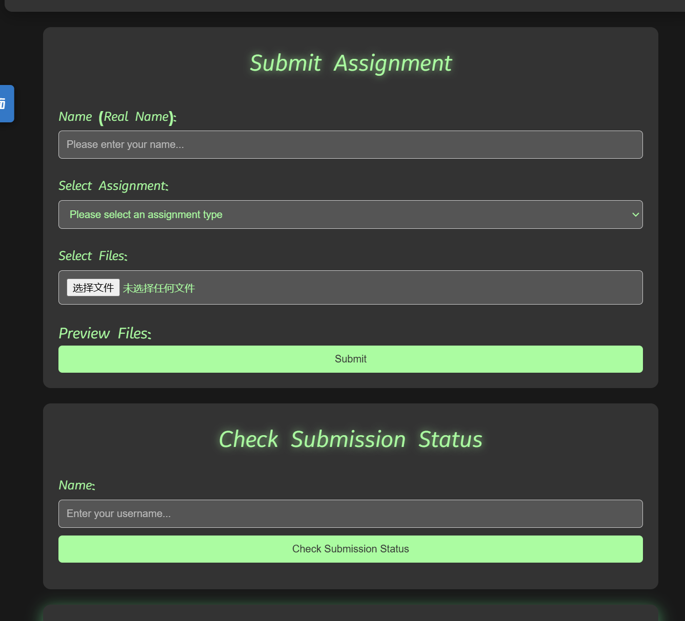
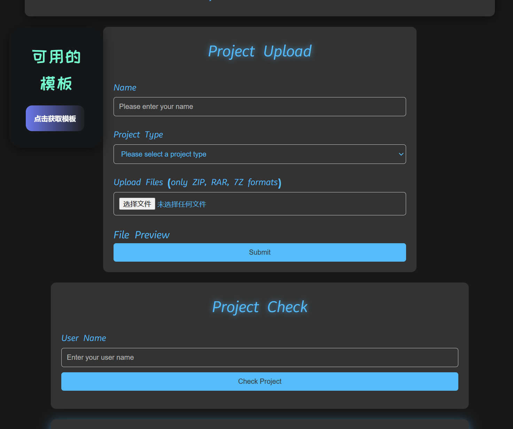
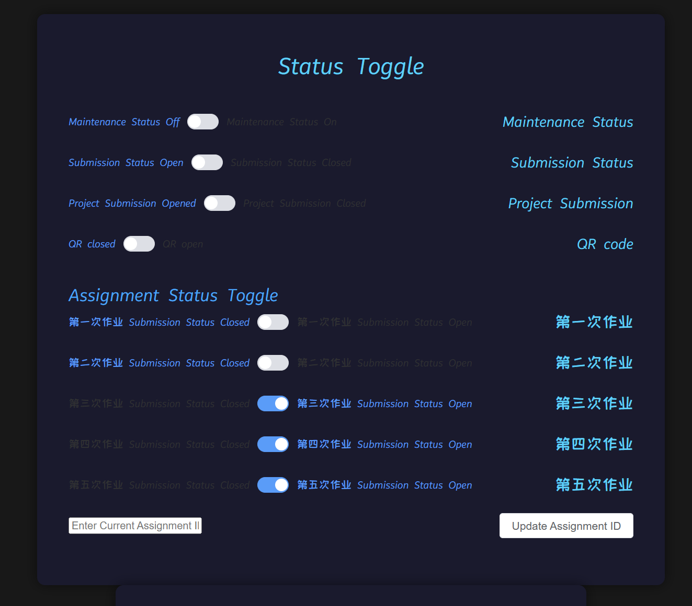

# FakeBaidu - Frontend

A dynamic web platform inspired by Baidu, built with modern frontend technologies.

## Features
- **User Authentication**: Secure login and registration system.
- **Assignment Submission**: Upload and manage assignments with file type validation.
- **Real-time Chat**: Instant messaging between users.
- **Multilingual Support**: Switch between languages using Vue I18n.
- **QR Code Verification**: Link verification with expiration timers.

## Tech Stack
- **Framework**: Vue 3
- **UI Components**: Element Plus
- **Build Tool**: Vite
- **Routing**: Vue Router
- **State Management**: Vuex
- **Internationalization**: Vue I18n
- **Dependencies**: Axios, qrcode.js, markdown-it

## Installation
1. Clone the repository:
   ```bash
   git clone https://github.com/lingyunmo/fakebaidu.git

2. Navigate to the project directory:
   ```bash
   cd fakebaidu

3. Install dependencies:
   ```bash
   npm install

4. Run the development server:
   ```bash
   npm run dev

5. Open your browser and visit http://localhost:3000.

## Usage
- **Login**: Use the login page to access the platform.
- **Submit Assignments**: Navigate to the submission page, select the assignment type, and upload files.
- **Chat**: Access the chat room to communicate with other users.
- **QR Verification**: Scan the QR code to verify links.

## Screenshots




## Contributing
Contributions are welcome! Please fork the repository and submit a pull request.

## License
All Rights Reserved.